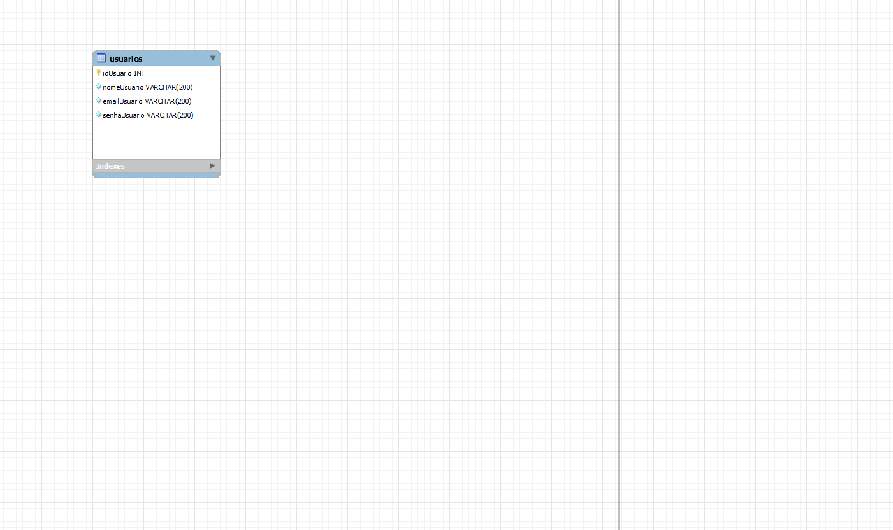

## Teste Back-End para o Projeto Bootcamp Gama

### Tecnologias Utilizadas

NodeJS com Express, Sequelize, MySQL, Express Validator, BcryptJS e JWT.

#### Funcionalidades

##### Endpoints

- Criação de Usuário - POST - /users/new

- Login de Usuário - POST - /users/login

##### Instruções para rodar o projeto

- npm install - para instalar as dependências.

- $env:DEBUG='back-end-bootcamp-una:\*'; npm start - para iniciar o back-end na porta 3000.

##### Diagrama das Tabelas

